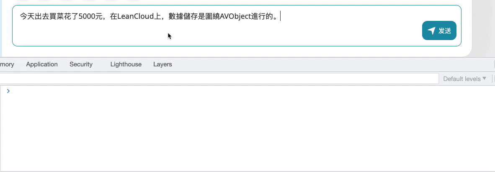

#  Chrome-extension-text-formatting

Format your text anytime in the web editor.

通过谷歌扩展，快速将选中文本，格式化为符合 [中文文案排版指北](https://github.com/sparanoid/chinese-copywriting-guidelines) 的文本。

## How to install

1. 打开 Chrome 扩展页面 `chrome://extensions/`
2. 下载本项目至本地
3. 点击左上角 `Load unpacked` 按钮，加载此项目
4. 如果扩展程序需要特定的权限或数据，您会看到提示。若要批准，请点击添加扩展程序

完成安装后，将会看到本扩展被添加到扩展列表。

## How to use

1. 选择你需要格式化的文本内容
2. 右键呼出菜单，选择 `Text formatting` 按钮
  2.1 如果当前选择内容处于 `input` 或者 `textarea` 输入框内，会完成自动文本替换
  2.2 如果当前选择内容处于不可编辑状态，可打开控制台查看格式化后的内容

